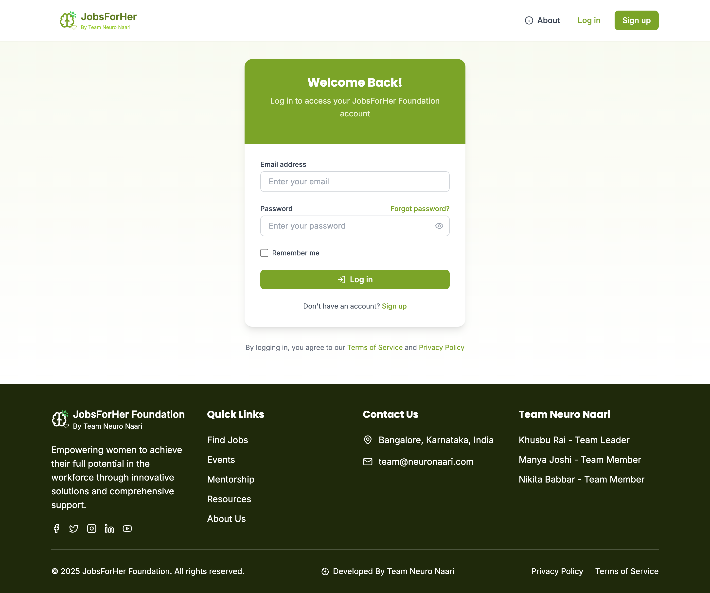
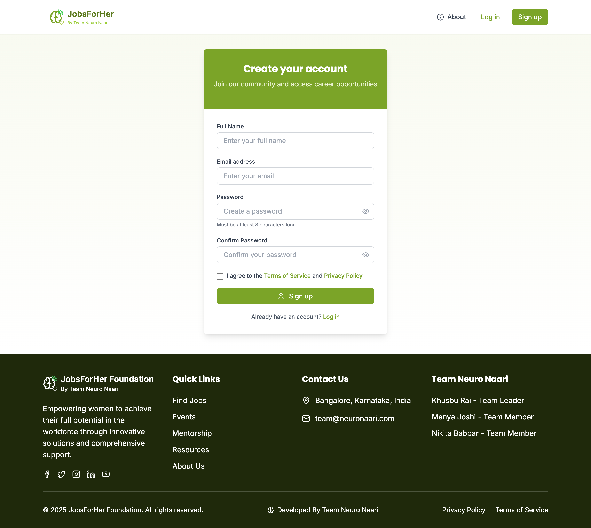
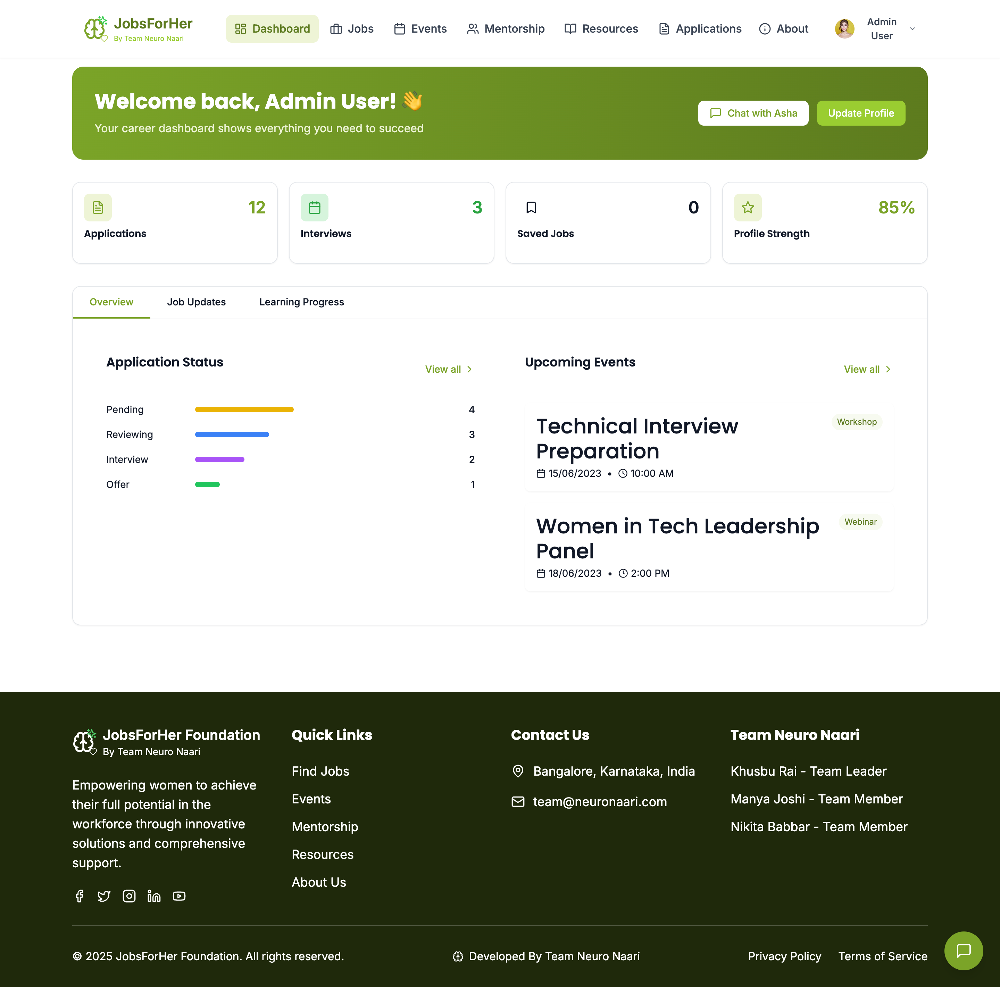
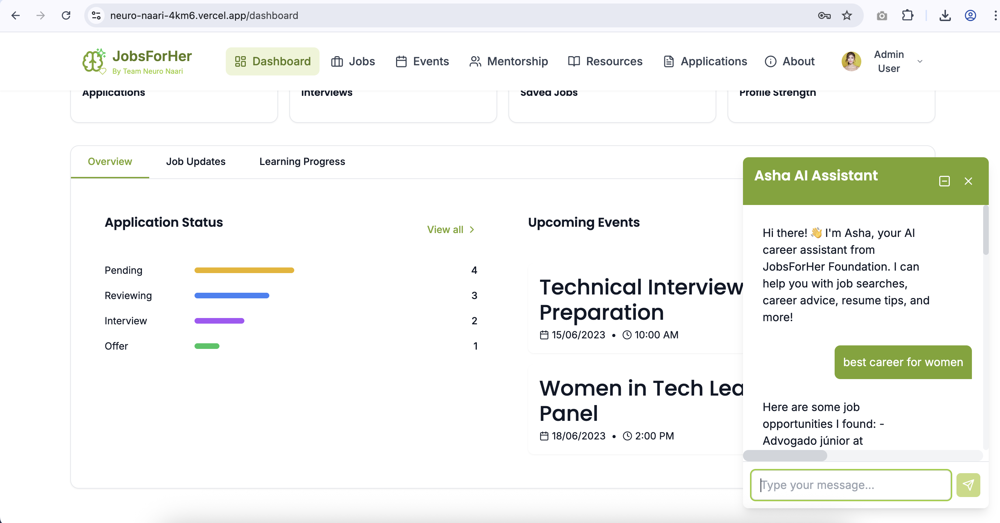
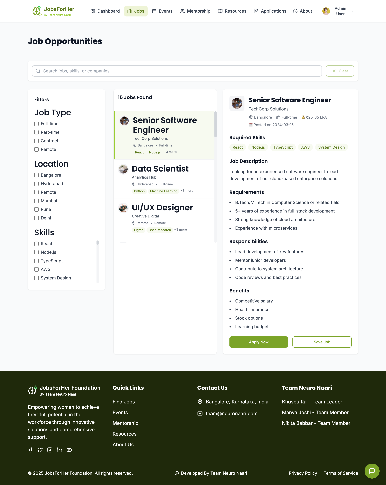
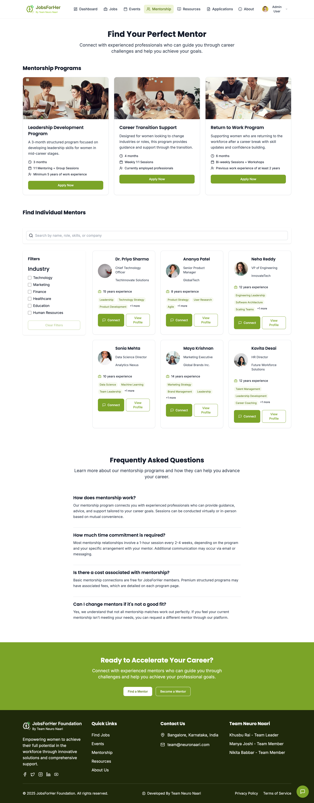
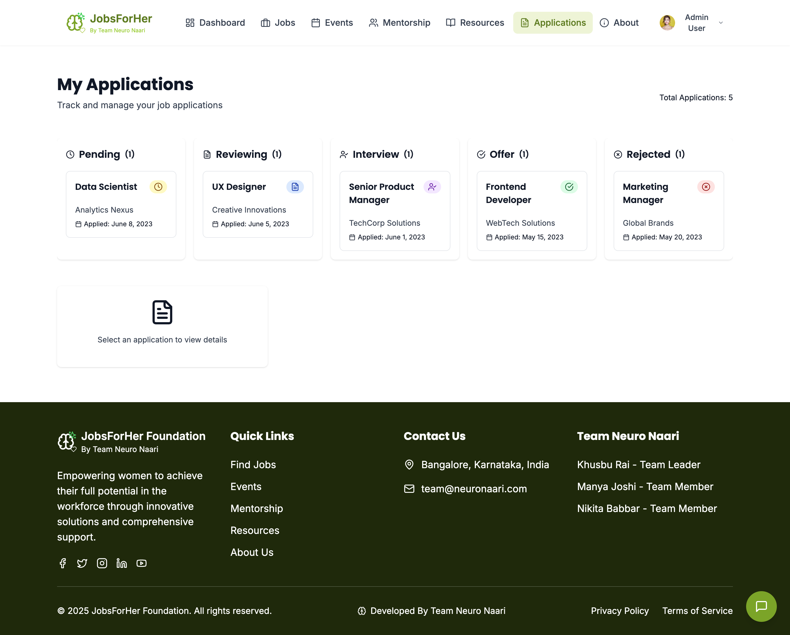
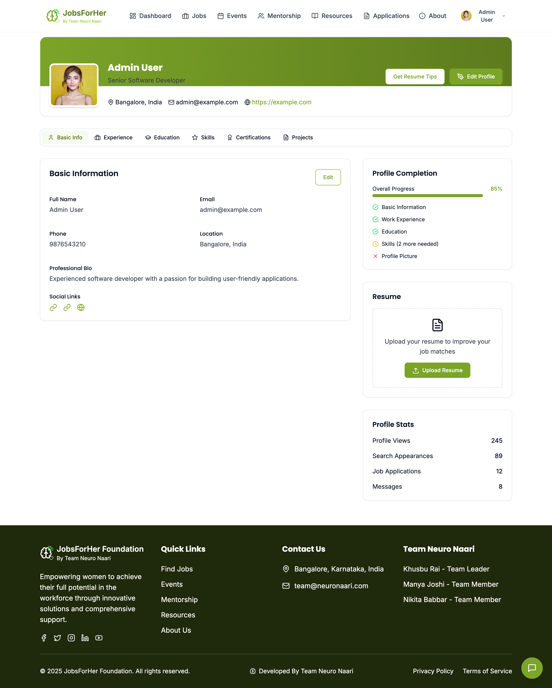

# 🧠 Neuro Naari 

## 📖 Project Overview

**Neuro_Naari** is an AI-powered web application designed to empower women in their career journeys by providing:

- Curated **job opportunities**
- Access to **community events**
- Personalized **mentorship advice**

Our mission is to bridge the gap between **skills and employment** for women, especially in **underserved communities**, using the power of AI.

---

## 🚀 Tech Stack

### Frontend
- **React (TypeScript)**
- **Zustand** (State management)
- **TailwindCSS** (Styling)
- **Lucide React** (Icons)
- **Vite** (Build tool)

### Backend
- **Flask** (Python)
- **LangChain** + **Gemini API** (Google Generative AI)
- **Chroma DB** (Vector database for semantic search)
- **CORS** (Cross-origin access)
- **Flask session** (State management)

---

## Screenshots

1. Homepage - Landing Page


2. Login page


3. Signup Page


4. Dashboard page


5. Asha AI


6. Job Listing


7. Events Page


8. Mentorship Page


9. Career Resources page


10. Application Tracker


11. Profile page


---

## 🧩 Project Structure

### Frontend Directory Structure (src/)
```
src/
├── App.tsx
├── components/
│   ├── auth/            → Protected route handling
│   ├── chatbot/         → Chatbot widget and UI
│   ├── dashboard/       → Dashboard stats and charts
│   ├── jobs/            → Job search, filters, saved jobs
│   └── layout/          → Header, Footer
├── pages/               → Routing pages (Jobs, Events, Profile)
├── store/               → Zustand stores (auth, chatbot, jobs, etc.)
├── index.css
├── main.tsx
```

### Backend Overview (Flask App)
```
app.py                   → Flask app entry point & chat API
    → Core AI logic with LangChain + Gemini
    → Intent classifier, job search, events search
    → Vector store using Chroma + embeddings
    → Loads JSON data as Documents
    → Combines logic to handle user queries
linkedin_jobs.json       → Job dataset
scraped_data.json        → Community event dataset
```

---

## ⚙️ Setup & Installation

### Prerequisites
- Node.js (v16+)
- Python 3.9+
- `virtualenv`
- A valid **Google Gemini API key**

---

## 🖥️ Frontend Setup

1. Navigate to frontend:
   ```bash
   cd frontend
   ```

2. Install dependencies:
   ```bash
   npm install
   ```

3. Start development server:
   ```bash
   npm run dev
   ```

4. ✅ The app will be running at `http://localhost:5173`

---

## 🧠 Backend Setup (Flask + LangChain)

1. Create a virtual environment:
   ```bash
   python -m venv venv
   source venv/bin/activate   # On Windows use `venv\Scripts\activate`
   ```

2. Install dependencies:
   ```bash
   pip install -r requirements.txt
   ```

3. Set your API key (or use `.env`):
   ```bash
   export GOOGLE_API_KEY="your-api-key"
   ```

4. Start the server:
   ```bash
   python app.py
   ```

5. ✅ The backend API will be available at `http://localhost:5000/api/chat`

---

## 🤖 Chatbot Flow

### Message Lifecycle

1. **User sends message**
2. Frontend updates state, shows user message + **skeleton loading**
3. Backend classifies the **intent** (job, mentorship, community)
4. Based on intent:
   - Uses vector search (Chroma) for relevant context
   - Uses **Gemini LLM** to generate answer
5. Response is returned and replaces the skeleton loader

### Types of Responses
- 🧳 **Jobs** → Fetched from `linkedin_jobs.json`
- 📅 **Events** → Fetched from `scraped_data.json`
- 👩‍🏫 **Mentorship** → Generated with Gemini based on query

---

## 🧠 Intent Classification Logic

| Intent Category       | Triggered When User Asks About                         |
|----------------------|---------------------------------------------------------|
| `Job Opportunities`  | Jobs, vacancies, hiring                                 |
| `Community Events`   | Events, workshops, local meetups                        |
| `Mentorship Programs`| Guidance, resume help, interviews, upskilling resources|

This is handled by the `IntentClassifierAgent`.

---

## 🎨 Chatbot UI Logic

- **Component:** `ChatbotWidget.tsx`
- **Store:** `chatbotStore.ts` (Zustand)
- **Features:**
  - Auto-scroll to new messages
  - Typing animation (dots or skeleton)
  - Conditional rendering based on `isTyping`
  - Authenticated-only access

---

## 🛡️ Auth Flow

- Managed using `authStore.ts`
- Unauthenticated users cannot open or use the chatbot
- Protected routes use `ProtectedRoute.tsx`

---

## 📡 API

### POST `/api/chat`

**Request:**
```json
{
  "message": "I'm looking for jobs in Bangalore"
}
```

**Response:**
```json
{
  "response": "Here are some job opportunities I found:\n- Frontend Dev at XYZ..."
}
```

## 🔐 Environment Variables

Set your `.env` or export manually:

```env
GOOGLE_API_KEY=your-api-key-here
```

---

## 💡 Future Improvements

- Add user feedback (👍/👎) on AI responses
- Allow saving and revisiting chat history
- Improve intent classification with custom prompt tuning
- Add file upload for resume review

---

## 🙌 Credits

**Neuro_Naari** is built with ❤️ to empower women in tech and beyond.  
Supported by the JobsForHer Foundation.

---